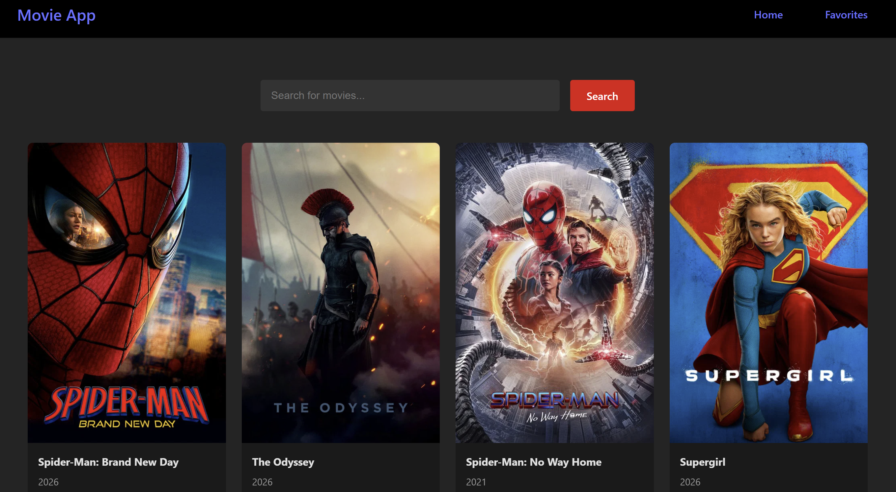
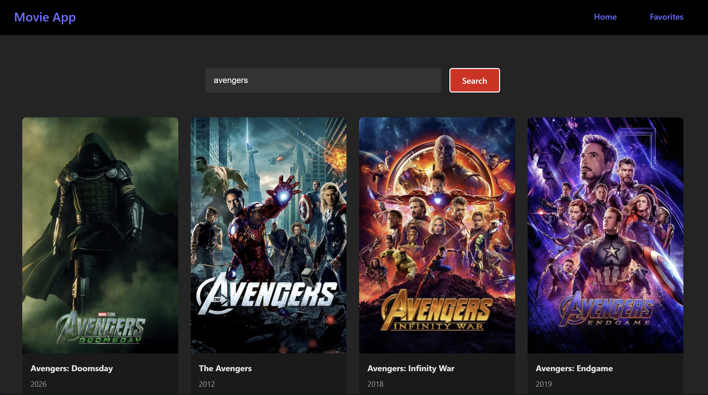
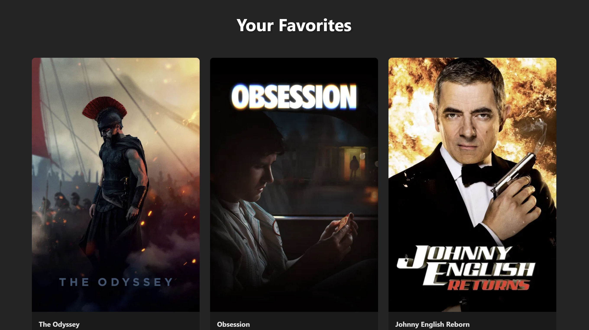

# 🎬 Movies List Application

A modern React movie discovery application powered by the **TMDB API**. Browse popular movies, search for titles, and save your favorite movies with persistent browser storage.

Built with **React + Vite**, with client-side routing and a clean component-based architecture.

---

## ✨ Features

* 🔎 **Movie Search** — Search TMDB for movies by title.
* 🔥 **Popular Movies** — Discover currently popular movies on the home page.
* ❤️ **Favorites** — Save and remove movies from your personal favorites list.
* 💾 **Persistent Favorites** — Favorites are stored using `localStorage`.
* 🧭 **Client-Side Routing** — Navigate between Home and Favorites without page reloads.
* 📱 **Responsive UI** — Designed to work across desktop and mobile screen sizes.
* ⚡ **Fast Development** — Built with Vite for a fast development experience.
* 🎞️ **TMDB Integration** — Movie information and posters are retrieved from The Movie Database API.

---

## 🖼️ Screenshots

### Home Page



### Search Results



### Favorites


---

## 🛠️ Tech Stack

| Technology            | Purpose                              |
| --------------------- | ------------------------------------ |
| **React**             | Frontend UI development              |
| **Vite**              | Development server and build tooling |
| **React Router**      | Client-side navigation               |
| **TMDB API**          | Movie data and search                |
| **JavaScript (ES6+)** | Application logic                    |
| **CSS**               | Styling and responsive layout        |
| **localStorage**      | Persistent favorite movies           |
| **npm**               | Package management                   |

---

## 📁 Project Structure

```text
react-app/
│
├── public/
│
├── src/
│   ├── components/
│   │   └── MovieCard.jsx
│   │
│   ├── contexts/
│   │   └── MovieContext.jsx
│   │
│   ├── pages/
│   │   ├── Home.jsx
│   │   └── Favorites.jsx
│   │
│   ├── services/
│   │   └── api.js
│   │
│   ├── App.jsx
│   └── main.jsx
│
├── screenshots/
│   ├── home.png
│   ├── search.png
│   ├── favorites.png
│   └── mobile.png
│
├── .env
├── .gitignore
├── package.json
├── package-lock.json
└── README.md
```

---

## 🚀 Getting Started

### Prerequisites

Make sure you have the following installed:

* **Node.js 16+**
* **npm**

You can verify your installation with:

```bash
node --version
npm --version
```

---

### 1. Clone the Repository

```bash
git clone <your-repository-url>
cd <repository-folder>
```

### 2. Install Dependencies

```bash
npm install
```

### 3. Configure the TMDB API

Create a `.env` file in the project root:

```env
VITE_TMDB_API_KEY=your_api_key_here
```

Then make sure `src/services/api.js` uses the environment variable:

```js
const API_KEY = import.meta.env.VITE_TMDB_API_KEY;
```

You can obtain a TMDB API key from:

**https://www.themoviedb.org/**

### 4. Start the Development Server

```bash
npm run dev
```

The application will be available at:

```text
http://localhost:5173/
```

---

## 📦 Available Scripts

### Development

```bash
npm run dev
```

Starts the Vite development server.

### Production Build

```bash
npm run build
```

Creates an optimized production build.

### Preview Production Build

```bash
npm run preview
```

Runs the production build locally for testing.

### Lint

```bash
npm run lint
```

Checks the project for code quality and linting issues.

---

## 🔐 Environment Variables

This project requires a TMDB API key.

Create a `.env` file:

```env
VITE_TMDB_API_KEY=your_api_key_here
```

**Regional access note:** Some users report that direct requests to the TMDB API may be restricted from certain locations (for example, India). If you experience access errors, consider using a VPN or deploying a server-side proxy in a region where the API is reachable. A server-side proxy is recommended for production because it also keeps the API key private.

### Important

Do **not** commit your `.env` file to GitHub.

Add the following to `.gitignore`:

```gitignore
.env
.env.local
.env.*.local
```

For a public repository, environment variables are strongly recommended instead of hardcoding API credentials inside the source code.

> **Note:** Vite variables prefixed with `VITE_` are exposed to the client-side application. They should not be treated as highly confidential server-side secrets.

---

## 🎯 Application Flow

```text
                    ┌──────────────────┐
                    │     React App     │
                    └────────┬─────────┘
                             │
              ┌──────────────┴──────────────┐
              │                             │
        ┌─────▼─────┐                ┌──────▼──────┐
        │    Home   │                │  Favorites  │
        └─────┬─────┘                └──────┬──────┘
              │                             │
        Search / Popular                    │
              │                             │
              ▼                             │
        ┌─────────────┐                      │
        │  TMDB API   │                      │
        └──────┬──────┘                      │
               │                             │
               ▼                             │
        ┌─────────────┐                      │
        │ Movie Cards │◄─────────────────────┘
        └──────┬──────┘
               │
         Add / Remove
           Favorite
               │
               ▼
        ┌─────────────┐
        │ localStorage│
        └─────────────┘
```

---

## ❤️ Favorites

Favorite movies are stored in the browser using:

```text
localStorage
```

The application uses the following storage key:

```text
favorites
```

This means users can close or refresh the browser without losing their saved movies.

---

## 🧩 Key Components

### `App.jsx`

Handles the main application structure and routing.

### `Home.jsx`

Responsible for:

* Fetching popular movies
* Searching movies
* Displaying search results
* Rendering movie cards

### `Favorites.jsx`

Displays the movies saved by the user.

### `MovieCard.jsx`

Reusable movie card component responsible for displaying movie information and handling favorite actions.

### `MovieContext.jsx`

Manages favorite movie state and synchronizes it with `localStorage`.

### `api.js`

Contains the TMDB API configuration and functions used to retrieve movie data.

---

## 🌐 API

Movie data is provided by **The Movie Database (TMDB)**.

The application uses the TMDB API to retrieve:

* Movie titles
* Poster images
* Movie descriptions
* Release information
* Popular movie listings
* Search results

This product uses the TMDB API but is not endorsed or certified by TMDB.

---

## 🧪 Future Improvements

Potential improvements for future versions include:

* [ ] Movie details page
* [ ] Genre-based filtering
* [ ] Movie ratings
* [ ] Release-date filtering
* [ ] Pagination / infinite scrolling
* [ ] Loading skeletons
* [ ] Error and empty states
* [ ] Dark / light theme
* [ ] User authentication
* [ ] Cloud-synced favorites
* [ ] Personalized movie recommendations
* [ ] Production deployment
* [ ] Automated testing

---

## 🚀 Deployment

The application can be deployed using platforms such as:

* Vercel
* Netlify
* GitHub Pages

When deploying, make sure the `VITE_TMDB_API_KEY` environment variable is configured in the hosting platform.

---

## 📌 Project Highlights

This project demonstrates practical experience with:

* React component architecture
* React Hooks
* Context API
* REST API integration
* Asynchronous JavaScript
* Client-side routing
* Browser `localStorage`
* Environment variables
* Responsive frontend development
* Vite-based development workflows

---